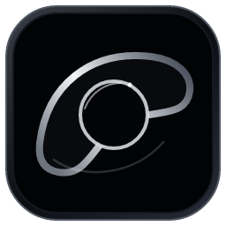
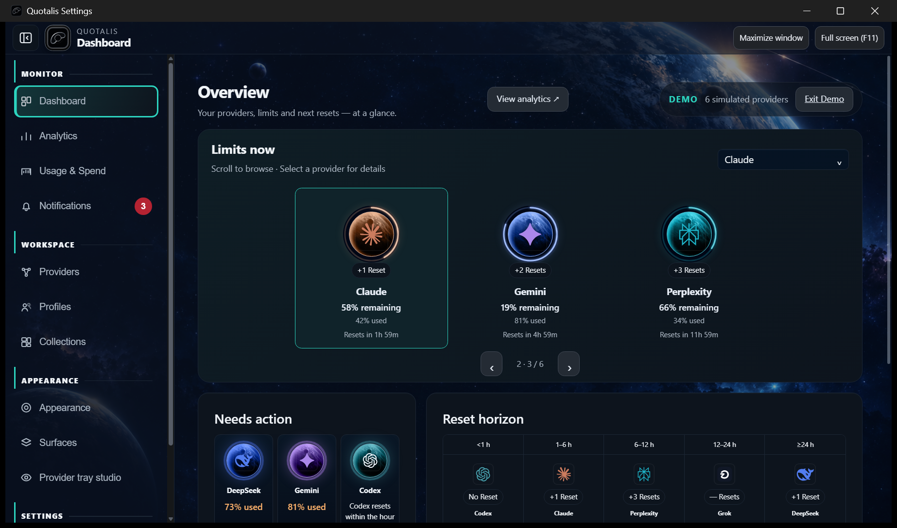

<p align="center"></p>

# Quotalis

**Your AI workspace, in one orbit.**

Quotalis brings AI-provider limits, reset schedules and usage history into a customizable Windows desktop workspace. Keep your providers in view with a planetary dashboard, compact floating surfaces and system-tray controls.

[Download for Windows](https://github.com/iModhish1/Quotalis/releases/latest) · [Explore the source](https://github.com/iModhish1/Quotalis) · [Get started](docs/GETTING_STARTED.md)



*Actual Windows app screenshot with clearly labeled simulated provider data.*

## A workspace that feels like yours

- **Planetary dashboard.** Original provider logos, reported plan details, current limits and reset times. Browse a compact carousel, arrange providers left or right, and keep your chosen order and position between visits.
- **Dedicated analytics.** Explore observed quota history, individual provider windows and available usage records, with filters and detailed values alongside charts.
- **Reset visibility.** Distinguish scheduled resets, observed changes and provider-reported banked reset inventory, including expiry dates when supplied.
- **Provider connections.** Manage supported OAuth, API-key, browser-cookie and CLI-backed integrations from a dedicated provider workspace. Connection methods follow each provider's capabilities.
- **Notification history.** Revisit recorded reset and quota-change observations, search and filter them, mark items read, and see an unread badge. Observation and receipt times stay visible.
- **Personal presentation.** Structure themes, original logo finishes, provider presentation styles, backgrounds, resizable navigation and configurable floating surfaces.
- **Profiles and collections.** Organize providers and presentation choices for different workflows.
- **Demo Mode.** Explore simulated provider data in a clearly marked workspace, separate from real history.
- **English and Arabic.** Localized controls, right-to-left layouts and customizable time/reset presentation.

Quotalis displays provider-reported values and preserves their meaning: quotas, Spend, Balance and Credits are distinct. Analytics use available observations rather than inventing missing values.

## Install and start

Choose a Windows x64 download from [Releases](https://github.com/iModhish1/Quotalis/releases):

| Download | Use |
| --- | --- |
| `Quotalis-0.11.0-x64-Setup.exe` | Per-user installation with desktop integration and runtime setup |
| `Quotalis-0.11.0-x64-Portable.zip` | Extract the complete folder and open `Quotalis.exe` |
| `Quotalis-0.11.0-x64-CLI.zip` | Command-line tools for usage and configuration |

Windows x64, Microsoft Edge WebView2 Runtime and the Microsoft Visual C++ x64 runtime are required. Setup can install missing runtimes. The ZIP edition uses the normal per-user settings and history location; keep its supplied icons beside the executable.

Open **Providers** to configure your integrations, or enable **Demo Mode** in Dashboard Studio to explore first. Customize your workspace through Appearance, Provider Display and the surface controls.

## Build from source

Use Windows with Rust stable (MSVC), Visual Studio C++ Build Tools, Node.js 24 and pnpm 11.24.0.

```powershell
pnpm --dir apps/desktop-tauri install --frozen-lockfile
pnpm --dir apps/desktop-tauri test
cargo test --workspace
node scripts/build-dev-verified.mjs
```

The final command builds the isolated Dev channel. For the standard desktop executable:

```powershell
pnpm --dir apps/desktop-tauri run tauri:build
```

The React/TypeScript UI is in `apps/desktop-tauri/src`; the Tauri shell is in `apps/desktop-tauri/src-tauri`; provider adapters and domain logic are in `rust/src`. Desktop builds use Tauri so the frontend is embedded in the executable.

## Created by

**Mohammed Modhish ([iModhish1](https://github.com/iModhish1))** · [TAWAJUD AI](https://tawajud.net)

Quotalis builds on [Win-CodexBar](https://github.com/nesszer/Win-CodexBar), [CodexBar](https://github.com/steipete/CodexBar), and portions of codexcontrol. Their contributions and licenses are preserved in [NOTICE](NOTICE) and [THIRD_PARTY_NOTICES.md](THIRD_PARTY_NOTICES.md). QuotaArc is the project's earlier name and remains in compatibility identifiers.

[MIT License](LICENSE)
